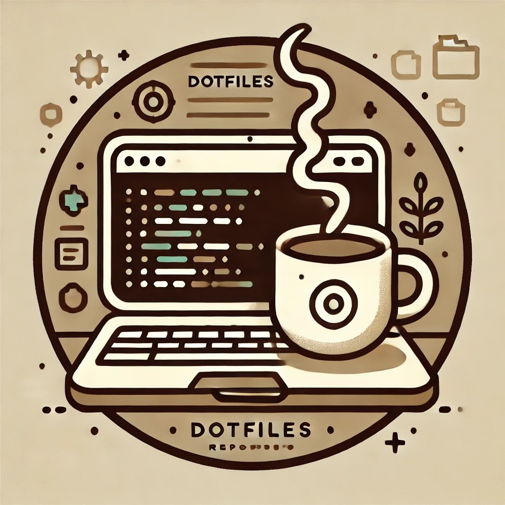

# Dotfiles

A personal collection of configuration files for Neovim, Alacritty, and Tmux.

  

## Repository Structure

#### Configurations (-L 1)

- `alacritty/`: Configuration files for Alacritty across Linux, Windows, and WSL
- `autohotkey/`: AutoHotkey scripts for symbols in Alacritty and WSL
- `bashrc/`: Bash configuration files
- `firefox/`: Firefox configuration and customization
- `git/`: Git configuration files
- `misc/`: Miscellaneous resources and files
- `nvim/`: Neovim configuration
- `tmux/`: Tmux configuration
- `wallpapers/`: Collection of wallpapers
- `wezterm/`: WezTerm configuration
- `wsl/`: Bash scripts for setting up a fresh WSL environment

#### Additional Documentation

- `wsl/README.md`: Automated setup script for a development environment
- `nvim/CustomKeymaps.md`: Overview of custom Neovim keymaps
- `nvim/alpha-dashboard.lua`: ASCII art collection for alpha-nvim
- `NeovimCheatsheet.md`: Curated list of shortcuts and commands for efficient Neovim usage
- `TmuxCheatsheet.md`: Curated list of shortcuts and commands for efficient Tmux usage
- `firefox/themes/amoled/`: AMOLED color scheme for Firefox with minor tweaks
- `misc/images/`: Images used in the README
